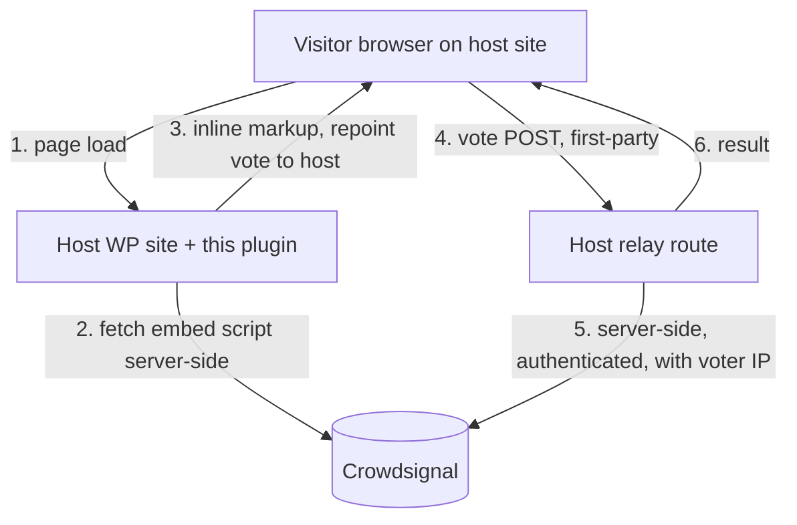

# First-party vote proxy for embedded classic polls

- **Date:** 2026-06-16
- **Status:** Draft for review
- **Scope:** This plugin only. (Any corresponding Crowdsignal service behaviour is tracked separately and is out of scope here.)

## Problem

Tracker-blocking browser extensions and privacy blocklists (for example the public `disconnect.me` list, which includes the `polldaddy.com` domain), together with browsers no longer sending third-party cookies, increasingly cause **embedded classic-poll votes to fail**. The poll may still render, but when the visitor clicks vote the browser refuses the cross-site request to the poll's domain, so the vote silently never happens. Repeat-vote prevention, which relied on a third-party cookie, also no longer works cross-site.

This affects **classic poll embeds** — pasted `poll.fm/{id}` / `polldaddy.com/p/{id}` links — on sites running this plugin.

## Goal

For sites running this plugin, make embedded classic-poll votes work despite tracker-blockers and third-party-cookie loss, by serving **both render and vote first-party** through the host site, so the visitor's browser never makes a blocked cross-site request.

## Non-goals

- Sites that do not run this plugin (raw pasted embeds with no host-side code) — separate effort.
- Modern Gutenberg poll/survey blocks, which already talk to Crowdsignal first-party.

## Solution overview

Everything lives in this plugin. The visitor's browser only ever talks to the **host origin**; the host talks to Crowdsignal **server-side**, where browser-level blocklists do not apply.

### A. Intercept pasted classic poll links

Register a handler (`wp_embed_register_handler`) that matches classic poll URLs (`poll.fm/{id}`, `polldaddy.com/p/{id}`) and runs **before** WordPress oEmbed, so the plugin controls the output for those URLs.

### B. Render first-party (fetch-and-rewrite)

The handler fetches the poll's embed script **server-side** (not blocked, because it is a server-to-server request) and inlines its markup from the **host origin**. It repoints the embed's vote target to a host relay route (C). The browser therefore makes **no cross-site request** to render or to vote.

### C. Host relay route

A REST route under the plugin namespace receives the visitor's answer(s) and forwards the vote to Crowdsignal **server-side**, authenticated with the **account's existing API credentials** (the partner GUID + user code the plugin already stores for `api.crowdsignal.com`) and including the **visitor's IP address**. It returns the result in the shape the inlined widget expects, so result bars render normally.

### D. First-party repeat-vote prevention

The plugin issues a stable, first-party `voter_id`:

- **Logged-in host user** → derived from the host account (a salted hash of the WP user id): one stable id per real person, not spoofable by the visitor.
- **Anonymous visitor** → a random value in a **first-party** cookie the host sets — clearable, but it survives the third-party-cookie blocking that breaks things today.

Repeat-vote dedup is stored on the host, keyed by `(poll_id, voter_id)`, replacing the lost third-party cookie.

## Components (files)

- `includes/legacy-poll-proxy/class-legacy-poll-gateway.php` — server-to-server HTTP to Crowdsignal (fetch embed script; forward vote with credentials + voter IP). Plain `wp_remote_*`.
- `includes/legacy-poll-proxy/class-loader-rewriter.php` — pure string transform: repoint the embed's vote target to the host relay.
- `includes/legacy-poll-proxy/class-voter-identity.php` — resolve/issue the first-party `voter_id`.
- `includes/legacy-poll-proxy/class-vote-dedup-store.php` — persistent `(poll_id, voter_id)` dedup.
- `includes/rest-api/controllers/class-legacy-poll-vote-controller.php` — the host relay route.
- `includes/legacy-poll-proxy/class-legacy-poll-embed-handler.php` — registers the embed handler; renders inlined + rewritten markup; wires the `voter_id` bridge.

Wiring follows the existing controller/hook pattern in `includes/class-crowdsignal-forms.php`.

## Threat model (plugin side)

| Vector | Mitigation |
| --- | --- |
| Visitor clears cookie / re-votes | Same ceiling as a normal first-party cookie; logged-in visitors are bound to their host account. |
| Relay used outside its embed | Public vote semantics — no worse than a normal poll vote; the relay only targets the embedded poll's id. |

The relay only works for polls associated with the connected Crowdsignal account; embeds of polls the account is not connected to fall back to the default embed.

## Open questions (verify in planning)

1. **Rewrite token** — pin exactly which token in the embed script to rewrite to the host relay base, and add a test that fails if the upstream embed shape changes.
2. **Result payload** — capture the success / already-voted / closed shapes the inlined widget consumes, and map the relay's response to them.
3. **`voter_id` derivation** — salting/hashing for the logged-in case; cookie attributes/lifetime for the anonymous case.

## Testing

- Interception fires for `poll.fm/{id}` / `polldaddy.com/p/{id}` and defers other URLs to oEmbed.
- Fetch-and-rewrite repoints the vote target and falls back gracefully if the server-side fetch fails.
- Relay forwards the visitor IP and credentials, records dedup on success, and short-circuits a repeat `(poll_id, voter_id)`.

## Rollout

- Behind a feature flag (a settings toggle).
- Styling/CSS, if any, in a separate PR.

## Out of scope

- Sites without the plugin (raw embeds).
- Any change to Crowdsignal services (tracked separately, privately).
